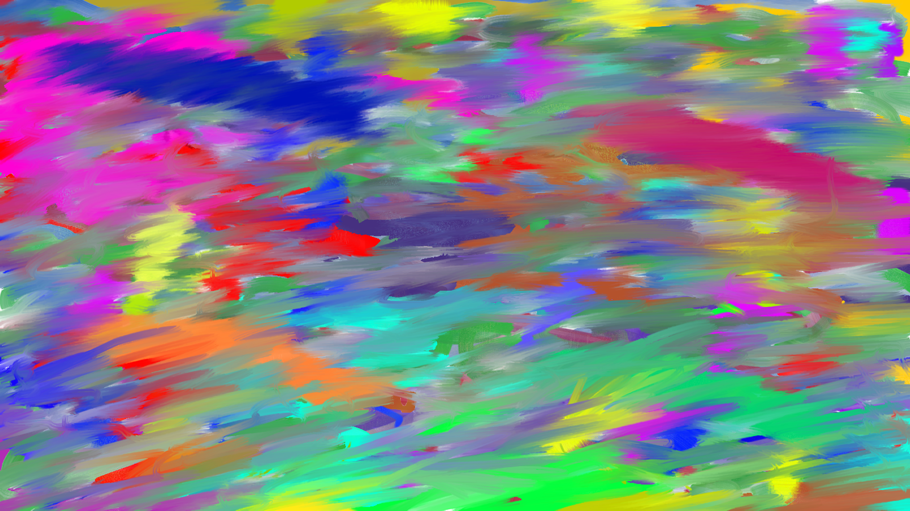
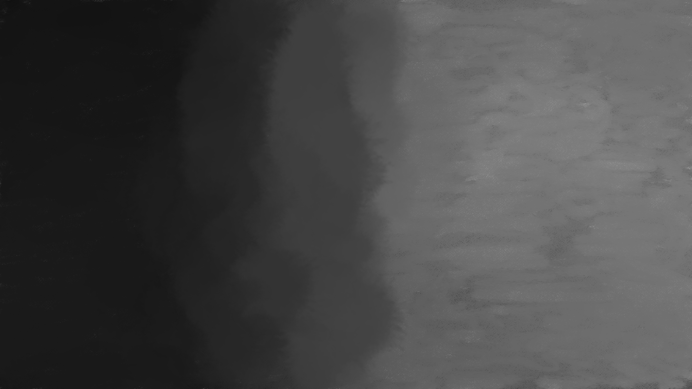

# VisualArt
#### An emergent art forest unraveling and co-evolving through the evolutionary lens of me affected by hermeneutic circular semiosis

 

> Feel free to download and use the artwork as long as you follow the license below

 This work is licensed under a <a rel="license" href="http://creativecommons.org/licenses/by-sa/4.0/">Creative Commons Attribution-ShareAlike 4.0 International License</a>.

> Currently exploring abstract expressionism (all the art is digitally drawn)

